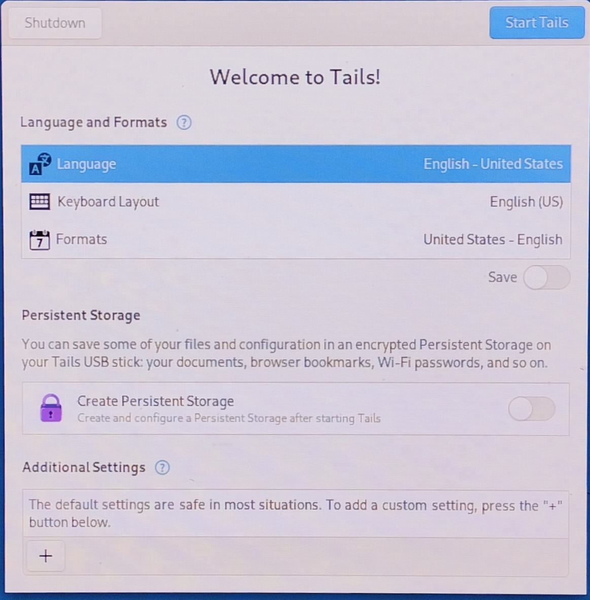
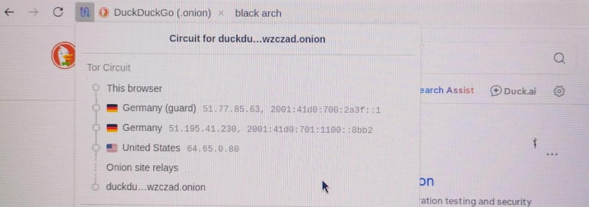

# Tails Linux
Tails is a linux based distro made with only two things in mind: Privacy and Anonymity

## Special pros of tails:

- **Amnesic:** 
  The moment the computer is shut down or USB is unpluged, Tails completely vanishes. It Runs entirely on computer's RAM. When it shuts down,   it overwrites its entire RAM footprint with Zeros, leaving no digital footprints, cookies or hisory.

- **Hides IP Address:** 
  All internet traffic is forced through the tor network by default, Making it insanely hard to be tracked. If an application tries to bypass    tor, it is blocked. This hides the physical location and IP Address, making it significantly harder to associate activity with the user’s     real IP address.

- **prevents DNS leaks:**
  on a normal operating system, even if one uses VPN or proxy, the computer asks the ISP to translate the web addresses like google.com         into IP addresses. DNS requests can reveal which domains are being looked up, even if the content of the traffic is encrypted. Tails          handles this by forcing all the DNS request through tor's built-in anonymous DNS resolver.

- **protection against malware:**
  If a malware is downloaded accidentally, it is generally removed after shutdown because the system is amnesic. However, this does not guarantee protection against every threat or exploit.

  

## **OPSEC Lessons**

opsec is not a script or a checklist to follow. It is the mindset that assumes that the internet is tracing everything. It involves looking at your own system and operations with a exploiter's perspective.

- **stylometry(Behavioral Fingerprinting):**
Even with the IP address hidden, a person can be tracked by comparing the vocabulary, typing style, common phrases used online with a public profile, liked LinkedIn with high accuracy.

- **Login:**
Even after using anonymity tools like tails, logging into profiles like that of Google or LinkedIn, etc, completely exposes the person.

## **Common Misconceptions:**

*"Dark web/Tor is inherently illicit or criminal."*
Tor was originally designed by the U.S. Naval Research Laboratory for Anonymous government communications. Today, it is used around the world by journalists, human rights whistleblowers, and citizens bypassing censorship.

## Welcome Screen

## Tor Connection

# Understanding the Tor Circuit

The image above shows the **Tor circuit** created while connecting to DuckDuckGo's `.onion` website.

Instead of sending traffic directly to the destination, Tor routes it through multiple relays. Each relay only knows a small part of the communication, which helps protect the user's anonymity.

## What the Screenshot Shows

- **This Browser**
  
  This is where the request begins.

- **Guard Relay (Entry Relay)**

  This is the first relay in the Tor circuit. Since it is directly connected to the user, it knows the user's IP address. However, it does **not** know the final destination.

- **Middle Relay**

  The middle relay simply forwards encrypted traffic between relays. It only knows the previous relay and the next relay, not the complete path.

- **Onion Site Relays**

  These appear because the destination is a `.onion` website. Unlike normal websites, the communication never leaves the Tor network, so there is **no Exit Relay**.

- **DuckDuckGo (.onion)**

  This is the destination website. Since it is an onion service, it does not learn the user's real IP address.

## Why Multiple Relays?

The interesting part is that **no single relay knows everything**.

- The **Guard Relay** knows who started the connection but not where it is going.
- The **Middle Relay** only knows the relay before it and the relay after it.
- For normal websites, an **Exit Relay** knows the destination website but not the user's IP address.
- For **.onion** websites, there is **no Exit Relay** because the communication stays entirely inside the Tor network.

This separation of information is what gives Tor much of its anonymity.

## Key Takeaway

Before learning how Tor works, it's easy to think that it simply changes or hides an IP address. In reality, Tor's anonymity comes from distributing information across multiple relays. Since no single relay knows both **who the user is** and **where the request is going**, tracing the communication becomes much more difficult.

  
 
